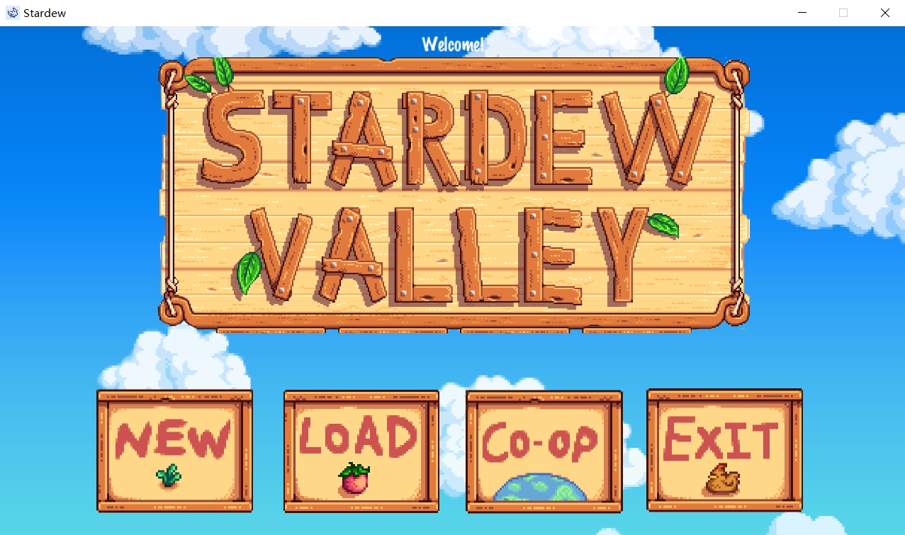

# 项目概述

**项目名称**: 星露谷物语类游戏

**引擎**: Cocos2d-x

**开发语言**: C++

**开发环境**：VS 2022; Cocos2d-x-3.17.2

**平台**: PC (Windows)

**游戏类型**: 模拟经营，角色扮演（RPG）

**项目描述**:  
本项目是一个基于《星露谷物语》玩法的模拟经营类游戏，玩家通过种植农作物、养殖动物、与村民互动等日常活动来逐步建设并经营自己的农场。游戏的核心玩法包括农业、养殖、钓鱼、社交、探险、技能升级等。

# 游戏核心功能

## 游戏场景

- **场景**: 
  游戏的世界包括多个区域，如农场、海滩、洞穴等。玩家可以自由在这些场景中移动，并与其他 NPC 互动。

- **天气系统**：

  游戏场景中实现了每日不同的天气，包括晴、雨、雪等，不同的天气会对农场的作物的生长以及农场动物的行为等产生相应的影响。例如作物在干旱以及暴雨的天气下死亡，动物在雨天时移动速度慢，晴天时移动速度快等。

## 玩家角色

- **玩家角色控制**: 

  玩家控制主角进行日常操作，如走动、采集、与 NPC 互动等。通过键盘、鼠标操作。

- **属性系统**: 

  玩家的属性包括在社区中的声望、不同技能点构成的技能树。

- **技能树**：

  玩家的角色技能树包裹农业、采矿、钓鱼、料理四个技能，按键盘E键打开。相应操作每完成一定次数后技能等级增加；同时等级越高相应操作时间越短或获取概率越高。

## 农场管理

- **耕种与收获**: 玩家可以对土地进行开垦并选择种植不同种类的作物，管理土地，浇水，施肥并等待作物成熟。
- **干旱威胁**：当一段时间不对作物进行浇水操作时作物死亡，此时需要移除作物才能进行下一轮种植。
- **病害威胁：**不同作物的不同生长阶段会随机产生病害，病害产生的概率随季节与天气发生变化。病害可用农药进行去除。当一段时间未处理时，作物死亡。
- **动物养殖**: 玩家可以饲养动物，如鸡、牛、羊等，并收集动物产品如鸡蛋、牛奶等。
- **钓鱼** : 本游戏设计了丰富的钓鱼场景
- **农场资源管理**：农场水资源有限且需定期进行补充，实现了水资源的管理。同时对种植的种子和肥料进行存储管理。

## 物品管理

- 玩家可以通过种植、挖掘、钓鱼、采集等方式获得各种物品，物品包括种子、工具、资源等。

## 社交系统

- **NPC 互动**: 游戏中有多个村民，玩家可以通过赠送礼物、聊天等方式与他们建立不同的关系，包括初始的陌生、友谊、浪漫关系。
- **任务系统**: 游戏内相应的npc有相应的任务，玩家可以接受这些任务，获取奖励并推动剧情发展，任务包括提交收集物品和修复建筑，任务完成后将提高玩家声望值并给出奖励。

## 时间系统

- 游戏内有日期和季节变化，农场内物品会随时间变化而发生不同的事件，玩家可以在特殊的时间内完成任务，包括节日庆典和社区活动。

## 存档功能

- 玩家可以在退出游戏后点击load加载之前的存档，这是游戏可玩性必不可少的一部分。

# 技术架构

## 游戏引擎

- **Cocos2d-x**: 使用 Cocos2d-x 引擎进行游戏开发，提供了灵活的场景管理、物理引擎和动画支持。
- **UI框架**: 使用 Cocos2d-x 内置的 UI 元素，如按钮、文本框、图片等，搭建游戏的用户界面。

## 面向对象编程

- **封装**：
  -  所有的组件都封装在类中， 在不同的场景中调用封装好的组件。
  - 数据和操作这些数据的函数组合在一起，并限制外部直接访问数据。
  - 保护数据安全，同时隐藏实现细节，使代码更加模块化。
- **继承和多态**: 
  - 不同的类之间有继承关系
  - 代码复用，通过继承基类共享通用功能
  - 灵活扩展功能，避免重复代码
  - 解耦模块间的依赖

## 代码风格统一且规范

# 开发流程

## 初期阶段

- **需求分析**: 了解游戏核心玩法，设计游戏角色、场景、工具等。
- **原型设计**: 根据需求设计游戏的核心原型，特别是玩家控制、场景切换、物品管理等功能。
- **项目结构搭建**: 使用 Cocos2d-x 初始化项目，搭建文件结构，准备好游戏的基础模块。

## 迭代阶段

- **场景与地图制作**: 设计和制作农场等游戏场景。
- **玩家行为系统**: 实现玩家角色的行为，包括走动、与物品互动、与 NPC 对话等。
- **任务与事件系统**: 设计并实现任务机制，设计事件触发机制。
- **农场管理系统**: 实现作物生长、养殖动物等玩法。

## 后期阶段

- **测试与调优**: 进行功能测试，修复游戏中的 bug，调优游戏的平衡性。

## 游戏资源

### 资源管理

- **图像资源**: 游戏内的各类图片，如角色、工具、场景等。
- **文本资源**: 用于任务、NPC 对话、菜单选项等文本的管理，存于constant.h中。

### 资源格式

- **图片**: PNG格式，用于存储精灵图、背景图等。
- **动画**: 使用 Cocos2d-x 的 `Action` 系统进行角色和物品的动画控制。

## 相关类实现

### Player（单例）

    键盘上下左右控制移动，鼠标左键使用工具。

### Bag（单例）

    鼠标滚轮选择背包中的物品，按键1-9也可以直接选择背包第一排的物品。
    
    选中的物品非工具时可以使用键盘Q键移除。
    
    有新的物品获取时，若背包非空则顺序加到背包中，相同的物品按数量不重复显示。

### Control（单例）

    对游戏中所有键盘和鼠标监视器进行初始化和控制。
    
    包括玩家移动、物品丢弃、烹饪、键盘选择物品的键盘监视器，和鼠标滚轮选择物品、右键条件打开对话框的鼠标监视器。

### Event

CommunityEvent

    社区特殊事件

Festival

    特殊节日庆典，继承了CommunityEvent类。

### Manager

DateManage

    进行游戏时间的管控，一定时间增加游戏日期。

WeatherManager

    进行游戏天气的管控，包括晴天、雨天、雪天。对作物和动物生长产生影响。晴天时Animal的移动速度较快，其他时较慢。

### DialogueBox

    用于打开玩家与npc的对话框和noticeBoard的对话框。Player在可打开对话框对象附近一定距离内使用鼠标右键则打开对话框，此后根据内容不同使用鼠标左键推进/选择、使用键盘Q键赠送npc礼物等。

### Item

Item为物品的抽象基类，用于表示玩家背包中的物品，

- AnimalItem抽象类及其派生类

  用于表示背包中的动物，玩家可以使用动物物品进行农场养殖

- Food抽象类及其派生类

  用于表示背包中的食物，玩家可以交易食物获取金币，也可以饲养动物，也可以自己食用增加生命值

- CampFire类

  在玩家初次使用鱼竿钓到第一条鱼后解锁。玩家在选择背包中Food类Item的时候靠近篝火，使用键盘C键可以进行烹饪当前食物。

- StoneItem类

  表示玩家获得的石头，可以用于交易

- Tool抽象类及其派生类

  用于表示玩家的工具，包括十字镐、锄头、镰刀、种子等，用于农场耕地、作物收获、敲击石头等诸多场景

### Map

 - BeachMap

   从农场场景向下即可走到

 - SceneMap

### Skill

 - Skill

   包括技能名称、最大等级、当前等级及不同效果

 - SkillTree

   集成了农业、钓鱼、烹饪、采矿的技能树，最高等级均为五级。

   农业：每种植五次植物升级，级别越高，采摘植物时获得第二份的概率越大。

   钓鱼：每钓到五次鱼类升级，级别越高钓鱼成功率越高。

   烹饪：每完成五次烹饪升级，级别越高一次烹饪所需时间越短。

   采矿：每挖下五块石头升级，级别越高，挖取时获得第二份石头的概率越大。

 - SkillTreeUI

   用于展示技能树的点数。使用键盘E键展开关闭。随玩家行动自动升级。

### Npc

    靠近后右键进行对话和其他选项（赠送礼物、接受任务、查看关系）

 - Wizaed Yuuu
   特殊任务：提交一只金枪鱼，之后获得随机数量的石头

 - Cleaner Levi
   特殊任务：在海滩地图找到告示牌，完成建筑修建，之后获得随机数量的金枪鱼

 - noticeBoard
   同样靠近后右键对话，若背包中含有三个及以上石头可以选择提交，提交后修建成功建筑，告示牌消失。

### Animal

 - Animal抽象基类

   定义了动物的通用属性（例如名称、位置、移动方式），动物的随着时间成长，并产出相应的物品

 - Cow、Chicken、Sheep、Pig类

   继承自Animal抽象基类，不同动物既有对通用属性的实现，也有各自的新的方法、属性与行为逻辑

 - AnimalManager类

   用于统一管理农场上的动物资源，包括动物随时间的生长、位置以及与玩家的交互。

 ### Crop

  - Crop抽象基类

    Crop 作为所有作物类的抽象基类，定义了作物在农场中的通用属性和方法，例如名称、生长阶段、是否遭受干旱、病害等。子类在继承时可以覆盖（override）某些方法，以实现不同作物的生长周期、收获产物以及特殊逻辑。

  - DogbaneCrop、CornCrop、CarrotCrop类

    继承自Crop抽象基类，有各自的不同的生长阶段。不同的生长阶段有不同的天数，以及在不同阶段、以及有着不同的病害逻辑，成熟后可以进行收获，并出售。

### **Weather**

- WeatherManager类

  WeatherManager 类用于管理全局的天气，可以产生晴天、小雨、暴雨、雪等不同天气状况并在地图上呈现。该类根据当前的季节，调整不同季节下不同天气的产生概率。不同的天气会对市场商品价格、作物生长以及动物的行为产生相应的影响。

### Maket

- MarketState类

  MarketState 类用于管理游戏或系统中的整体市场状态，包括市场中的商品种类、市场价格波动以及完成玩家与市场的交互的交易逻辑接口。

- MarketGood类

  MarketGood 类用于描述单个商品在市场中的具体信息和状态，包括名称、基础价格、当前价格等。商品会根据基础价格以及当前的天气、供需价格以及季节动态调整当前的售卖价格。

# 项目特色

## 合作

## 分工明确
